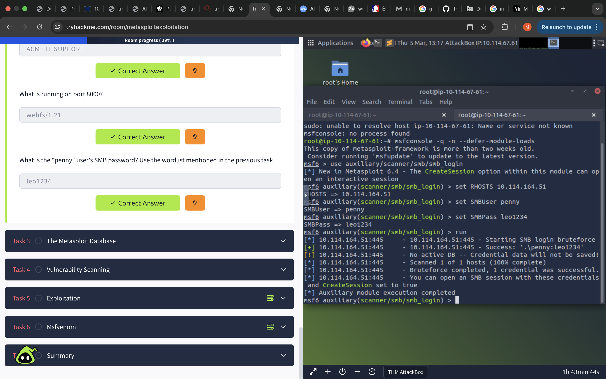
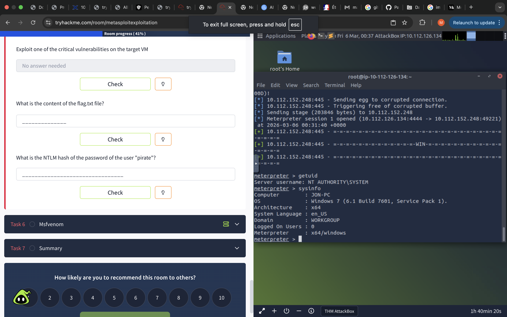

# TryHackMe-Lab-Log
This repository documents my journey through  multiple  Cyber-security labs completed in Pre-security and Cyber101

| Lab Name | Category | Key Skill Learned | Status |
| :--- | :--- | :--- | :--- |
| **Intro to Networking** | Networking | OSI Model & TCP/IP Handshake | ✅ Completed |
| **Linux Fundamentals** | Operating Systems | Terminal Navigation & Permissions | ✅ Completed |
| **Nmap Basics** | Enumeration | Network Scanning & Port Discovery | ✅ Completed |
| **Cryptography** | Security | Mastered Hashing (SHA-256) vs Encryption (AES/RSA) for data integrity. |  ✅ Completed |
| **Moniker** | Exploitation | Exploiting CVE-2024-21413 (MonikerLink) to leak NTLM hashes via SMB. | ✅ Completed |
| **Metasploit Intro** | Tools | Mastered the MSF Framework: Exploit selection, Payload configuration (Meterpreter), and Database (msfdb) management. |  ✅ Completed |
| **Metasploit Exploitation** | Tools | 	SMB Enumeration & Credential Auditing (Brute-force) | In progress |
#### **Technical Evidence: SMB Credential Audit**
Successfully identified weak credentials for user `penny` using a dictionary attack.

### **Phase 3: Exploitation (Task 5)**
- **Vulnerability:** MS17-010 (EternalBlue)
- **Payload:** `windows/x64/meterpreter/reverse_tcp`
- **Result:** Successfully gained **NT AUTHORITY\SYSTEM** privileges on the target Windows machine.

## 💼 Virtual Internships (Job Simulations)

| Company | Program | Task Completed | Key Skill |
| :--- | :--- | :--- | :--- |
| **Mastercard** | [Cybersecurity](https://www.theforage.com) | Phishing Analysis (Task 1) | Threat Detection & Social Engineering |
.
