# TryHackMe-Lab-Log
This repository documents my journey through multiple Cyber-security labs completed in Pre-security and Cyber101.

### 📊 Lab Progress Summary

> 💡 **Strategy Note:** While progressing through **Cyber101**, I am concurrently completing the updated **Pre-Security (Sections 4-7)**. This ensures I have a deep-dive understanding of OS Internals and Web Architecture, which strengthens my ability to perform manual exploitation and privilege escalation in the Cyber101 labs.

### 🛡️ Pre-Security (Sections 4-7)
*Focus: Deep-dive into Operating Systems and Web Architecture.*

| Lab Name | Section | Key Skill Learned | Status |
| :--- | :--- | :--- | :--- |
| Computer Fundamentals | Sec 4 | Hardware ID & BIOS/UEFI Boot Process | ✅ Completed  |
| Computer Types | Section 5 | Getting to know the various computer systems | ✅ Completed |
| Client Server Basics | Sec 6 | How client server communication occurs using IPs, ports and protocols | ✅ Completed |
| Virtualization Basics | Sec 7 | Hardware Optimization, Lab Building & Environment Management | ✅ Completed |
| Cloud Computing Fundamentals | Sec 8 | Cloud Service Models & shared responsibility framework | ✅ Completed  |
| Operating System Introduction | Sec 9 | OS Architecture,Privilege Seperation,Process Isolation,Access Control and Resource Management |  ✅ Completed |
| Windows Basics | Sec 10 | Windows GUI navigation, NTFS permissions, and essential administrative/security tools | ✅ Completed  |
| Linux CLI Basics | Sec 11 | Linux directory navigation, file manipulation, and fundamental terminal commands | ✅ Completed |
| Windows CLI Basics | Sec 12 | Command Prompt (CMD) and PowerShell core commands, file structure management, and system queries | ✅ Completed  |
| Operating System Security | Sec 13 | OS hardening, user privileges, firewall configurations, and endpoint protection layers |  ✅ Completed  |
| Data Representation | Sec 14 | Base numbering systems (binary, hex), character encoding (ASCII), and data types |  ✅ Completed  |
| Data Encoding | Sec 15 | Practical data transformation, binary-to-text encodings, and decoding mechanisms | ✅ Completed  |
| Python: Simple Demo | Sec 16 | Foundational logic, dynamic variables, condition handling, and input processing | ✅ Completed  |
| JavaScript: Simple Demo | Sec 17 | Client-side scripting execution, variables, event logic, and web application flow | ✅ Completed  |
| Database & SQL Basics | Sec 18 | Relational structures, Data Query Language (DQL), data selection, and conditional filters | ✅ Completed |
| Introduction to the CIA Triad | Sec 19 | Core security frameworks, data protection models, and risk management baselines | ✅ Completed |
| Cryptography Concepts | Sec 20 | Encryption basics, keys, algorithms, symmetric vs. asymmetric systems | ✅ Completed |
| Intro to Offensive Security | Sec 21 | Hacking history, red team roles, and hands-on legal web exploitation |  ✅ Completed  |
| Become a Defender | Sec 21 | Threat anticipation, risk prioritization, asset visibility, and blue team mindsets | ✅ Completed |
---
### 🔍 Technical Evidence & Writeups
## Lab: Inside a Computer System (TryHackMe)

## 🖥️ Overview
This lab covers the physical hardware components of a computer and the logical sequence of events that occur from the moment the power button is pressed until the Operating System (OS) is ready for use.

## 🏗️ Hardware Component Breakdown

| Component | Function | Analogy |
| :--- | :--- | :--- |
| **Motherboard** | The main circuit board that connects all parts. | The "Skeleton/Nervous System" |
| **CPU** | Performs all calculations and instructions. | The "Brain" |
| **RAM** | Short-term, volatile memory for active tasks. | The "Work Desk" |
| **Storage (HDD/SSD)** | Long-term, non-volatile data storage. | The "Filing Cabinet" |
| **PSU** | Converts AC power to DC for components. | The "Heart" |
---
.png)
---
## ⚡ The Boot Process (Step-by-Step)
Understanding the boot sequence is critical for identifying where a system might be failing or where an exploit could be injected.

1. **Power On**: The PSU sends power to the Motherboard.
2. **POST (Power-On Self Test)**: The BIOS/UEFI checks if the CPU, RAM, and Video Card are working.
3. **BIOS/UEFI**: The firmware initializes the hardware and looks for a bootable device.
4. **Bootloader**: The system hands off control to a small program (like GRUB or Windows Boot Manager) that knows how to load the OS.
5. **OS Kernel**: The "heart" of the Operating System is loaded into RAM, taking full control of the hardware.

## 🔍 Key Takeaways
- **Volatile vs. Non-Volatile**: Learned that RAM loses data without power, while SSDs keep it.
- **BIOS/UEFI Security**: These are the first lines of defense; if the BIOS is compromised, the entire OS above it is untrustworthy.
- **Peripherals**: Distinguished between input (Mouse/Keyboard) and output (Monitor/Speakers) devices.

  ---
  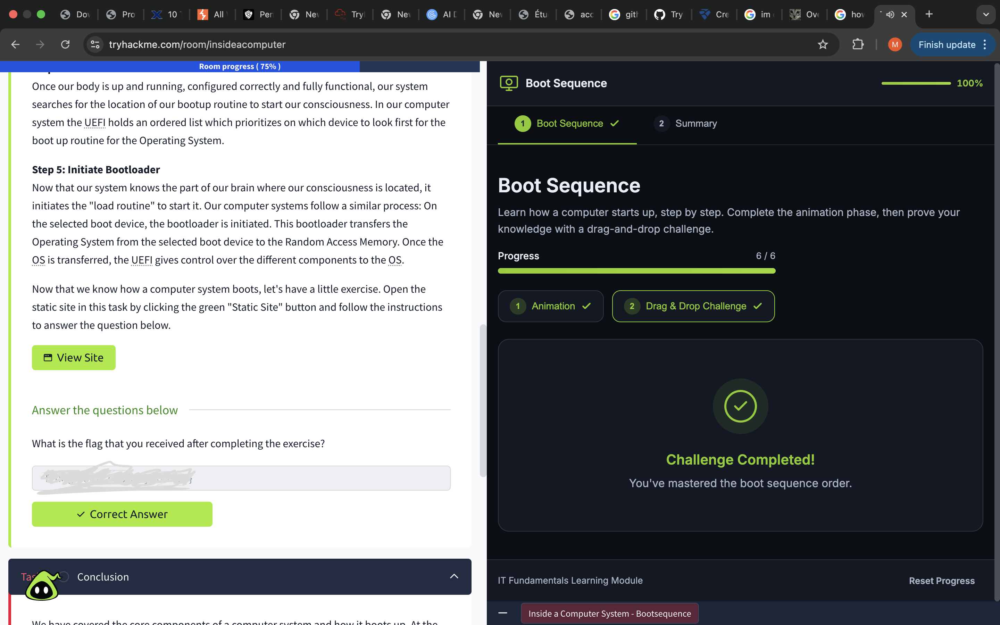

  ---
  
## Lab: Computer Types (TryHackMe)
## 🖥️ Overview
This module explores the diverse landscape of computing hardware, from everyday devices to high-powered enterprise infrastructure. Understanding these types is the first step in identifying "attack surfaces."

| Computer Type | Purpose | Security Perspective |
| :--- | :--- | :--- |
| **Personal Computers** | Laptops/Desktops for individual use. | High risk of social engineering (phishing). |
| **Workstations** | High-performance machines (NASA, Video Editing). | Targets for high-value data theft. |
| **Servers** | Provide services (Web, Email, File storage). | The "Main Prize" for hackers; requires strict access control. |
| **Mainframes** | Bulk data processing (Banks, Census). | Legacy systems that are often hard to patch. |
| **Supercomputers** | Complex calculations (Weather, Physics). | Extremely rare; high physical security. |
| **Embedded / IoT** | Single-purpose (Toasters, Smart Watches). | Often lack updates; easy entry point into a network. |

## 🔍 Key Takeaways
- Anything with a microchip is a computer,if a device is not segmented properly in a network ,it will create a doorway for an attacker into the system.
- Redundant power reduces a single failure point.
- Laptops throttle more than desktops due to less cooling space.
- Smartphones are optimized for efficiency hence have long lasting batteries compared to laptops.
- ECC RAM and certified drivers are more common in workstations.
- A hub or cloud server coordinates devices in smart homes.

  ---
  ## Lab: Client-Server Basics
  ## 🖥️ Overview
  This lab explores the fundamental relationship that powers the internet—the interaction between a requester (Client) and a provider (Server). It transitions from isolated computing to networked environments, focusing on how devices offer and consume services across a network.
  ## 🔍 Key Takeaways
  - **Client:** The device or software (like your web browser) that initiates a request for data or a service.
- **Server:** A powerful machine that "listens" for requests and provides the resource (like a website or file) back to the client.
- **Request-Response Cycle:** The fundamental way the web works—a client asks, and the server answers.
- **IP Address:** The unique numerical "home address" used to identify a server on the network so the client knows where to send requests.
- **Port:** A specific "doorway" on a server used for different services (e.g., Port 80 for web traffic, Port 25 for email).
- **Protocol:** The set of rules (like HTTP or HTTPS) that both the client and server agree to use so they can understand each other.
- **Security Insight:** Because servers are centralized hubs for data, they are primary targets for attacks like Denial of Service (DoS) or unauthorized access.

### 🌐 Web Communication in Practice (Lab)

In this lab, I simulated a real web request to see how data travels between my browser (the client) and the hosting server.

- **Status Code 200 OK:** Confirmed the request was successful and the server delivered the resource.
- **GET Method:** Used this protocol command to retrieve data from the host.
- **Loopback Address (127.0.0.1):** Identified that the server was hosted locally for this simulation.

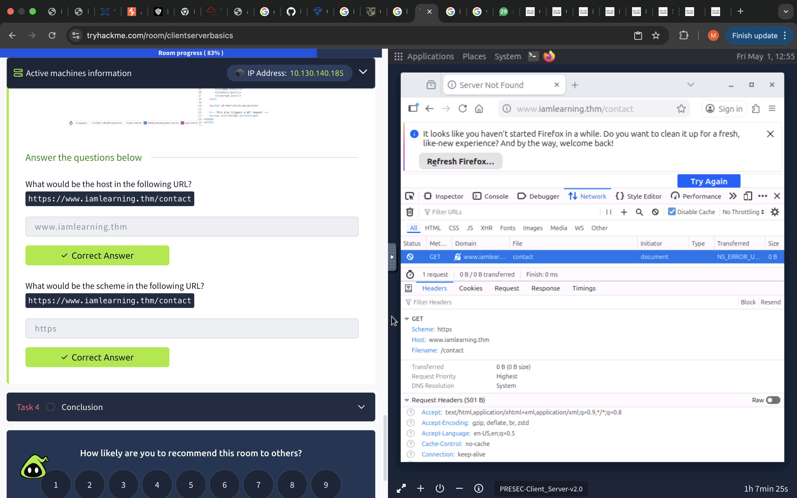

--

## Lab: Virtualization Basics
## 📖 Module Overview
This room explains how virtualization solves the problem of expensive, underutilized physical hardware. It introduces the Hypervisor—the "referee" software that manages and isolates multiple Virtual Machines (VMs) on a single host machine.

## 🧠 Key Takeaways:
- **Virtualization:** Technology that enables one physical computer to act as multiple separate, isolated systems.
- **Hypervisor:** The "manager" software that creates and runs VMs. There are two types:
- **Type 1:** Runs directly on hardware (best for big data centers).
- **Type 2 (Hosted):** Runs as an app on your regular OS (best for learning/home labs).
- **Virtual Machine (VM):** A complete, isolated computer running inside your real one, with its own CPU, RAM, and OS.
- **Container:** A lightweight "room" that shares the host's OS kernel to run a single app quickly—more efficient than a full VM.
** Security Insight:** Virtualization is essential for security because it allows you to run malicious files in an isolated sandbox where they can't harm your actual computer.

  ### 🛠️ Practical Lab: Virtualization Management
Successfully managed a simulated virtual environment for "AutoGalo" to resolve infrastructure issues:
- **Troubleshooting:** Identified a halted 'Mail-SERVER' and restored service to a running state.
- **Provisioning:** Created a new 'Marketing-VM' with specific resource allocations (4 CPU Cores, 8GB RAM, 100GB Disk).
- **Environment Audit:** Monitored host performance across physical servers (HV-PROD-01/02) to ensure hardware utilization.

--
## Lab: Cloud Computing Fundamentals
## Module Overview
This module explains how companies rent computing power over the internet instead of owning physical servers and also focuses on the different "as-a-Service" models (IaaS, PaaS, SaaS) .

## 🔍 Key Takeaways:
- **Service Models:** 
  - **IaaS:** Provider gives the hardware; I manage the OS and apps.
  - **PaaS:** Provider manages the OS; I just provide the code.
  - **SaaS:** Provider manages everything; I just use the software.
- **Shared Responsibility:** A critical security concept where the Cloud Provider secures the physical infrastructure, but the user is responsible for securing their own data and access credentials.
- **Deployment:** Differentiated between Public (shared), Private (dedicated), and Hybrid (mixed) cloud environments.

--
## Lab: Introduction to Operating Systems (TryHackMe)
## 🖥️ Overview
This module explores how an operating system (OS) acts as the vital bridge between a computer's physical hardware and user applications. Understanding the core structure of an OS is essential for identifying how systems protect themselves and where vulnerabilities can emerge.

| OS Component | Purpose | Security Perspective |
| :--- | :--- | :--- |
| **The Kernel** | Core program with complete, unrestricted hardware control. | High-value target; a compromise here grants total system control. |
| **User Space** | Restricted area where standard user programs and apps run. | Low-level privilege area; prevents buggy apps from crashing the whole system. |
| **Process Management** | Allocates CPU time and memory slices to active apps. | Ensures process isolation so malware in one app can't steal data from another. |
| **User Management** | Manages accounts, authentication, and file permissions. | Enforces the "Principle of Least Privilege" to restrict unauthorized file access. |
| **Device Management** | Uses drivers to communicate with hardware peripherals. | Malicious or unverified drivers can bypass security to inject malware. |

## 🔍 Key Takeaways
- The kernel handles the heavy lifting, while user space keeps regular applications isolated.
- Applications must use "System Calls" to request the kernel to perform tasks like reading a file.
- Process isolation ensures that if one application crashes, it does not bring down the entire OS.
- File permissions are the primary defense against users accessing data they shouldn't see.
- Antivirus software requires high-level privileges close to the kernel to monitor system threats effectively.
- Hardware is useless without an OS to coordinate resources and schedule CPU tasks.

## Lab: Windows Basics (TryHackMe)

## 🖥️ Overview
This lab provides a foundational look into the Windows Operating System environment, focusing on navigating the Graphical User Interface (GUI), understanding how files are organized and secured, and monitoring system behavior using native tools.

## ⚙️ Core Windows Components & Security

| Tool / Concept | Function | Security Perspective |
| :--- | :--- | :--- |
| **NTFS File System** | The standard file system structure for Windows NT branch. | Allows granular access control lists (ACLs) like Read, Write, and Execute permissions. |
| **Task Manager** | Provides real-time metrics on CPU, Memory, Disk, and Network usage. | Crucial for identifying unauthorized background processes, resource spikes, or persistent malware. |
| **Windows Security** | Built-in central hub for antivirus, firewall, and device health status. | The first line of defense; security analysts monitor this to ensure real-time protection isn't disabled. |
| **Control Panel / Settings** | Centralized interfaces for adjusting system configuration settings. | Targets for administrative modification; hardening a system involves locking these menus down. |
---
## 📖 Key Terminology & Applications (Security Perspective)

*   **Desktop:** The primary visual workspace. *Security Context:* Often cluttered by users with sensitive files or credentials exposed in plain sight.
*   **Taskbar:** The bottom control strip for quick access. *Security Context:* Used to quickly launch critical defensive tools like Task Manager or terminal instances during an incident response.
*   **Start Menu:** The central launchpad for applications and power controls. *Security Context:* Attackers often target the "Startup" folder hidden within here to maintain persistence after a reboot.
*   **Search:** The built-in indexing tool. *Security Context:* Allows defenders to rapidly locate deeply buried system administrative utilities or configuration panels.
*   **File Explorer:** The native file management interface. *Security Context:* Crucial for navigating the directory structure to audit NTFS permissions, locate hidden folders, or find malicious payloads.
*   **Windows Update:** The OS patch management system. *Security Context:* The single most critical tool for closing security gaps and fixing critical vulnerabilities before they can be weaponized.
*   **Microsoft Store:** The repository for trusted, signed applications. *Security Context:* Minimizes "shadow IT" risks by ensuring users download verified software instead of untrusted internet binaries.
*   **Windows Settings:** The modern configuration hub. *Security Context:* The go-to menu for managing user account privacy configurations, app permissions, and basic system hardening.
*   **Control Panel:** The legacy system management interface. *Security Context:* A high-value target for attackers looking to manipulate deeper network settings, device drivers, or local user accounts.
*   **Task Manager:** The real-time system monitoring tool. *Security Context:* Used to hunt for anomalous processes, detect unauthorized resource spikes, and forcibly terminate suspected malware executables.
*   **Windows Security:** The centralized defensive dashboard. *Security Context:* Provides an immediate health check on real-time antivirus protection, ransomware mitigations, and account security.
*   **Windows Defender Firewall:** The native network traffic filter. *Security Context:* Configured to enforce strict inbound and outbound rules, blocking unauthorized network connections and lateral movement.
---

## Lab: Linux CLI Basics (TryHackMe)

## 🖥️ Overview
This lab introduces the Linux Command Line Interface (CLI), focusing on text-based system navigation, file management, and understanding how the Linux operating system handles data structure without a graphical user interface.

## ⚙️ Core Linux Commands & Security Context

| Command | Function | Security Perspective |
| :--- | :--- | :--- |
| **`pwd`** (Print Working Directory) | Displays the exact absolute path of the current directory. | Helps orientation during a terminal session to ensure commands aren't executed in the wrong system folder. |
| **`ls`** (List) | Lists directory contents. Frequently used with `-la` flags. | Used to reveal hidden files (like `.bash_history` or hidden scripts) and audit file permissions. |
| **`cd`** (Change Directory) | Navigates between folders in the file system hierarchy. | Essential for moving into system configuration directories (like `/etc`) to inspect system settings. |
| **`cat`** (Concatenate) | Displays the contents of a text file directly in the terminal. | Used to quickly read configuration files, logs, or scripts without opening a heavy text editor. |
| **`find`** (Search Tool) | Recursively searches the directory tree for files matching specific criteria. | A critical tool for hunting down hidden web shells, unusual files, or specific logs across the system. |

## 🔍 Deep Dive: Master the `find` Command

Understanding how to construct search strings is essential for both privilege escalation and malware hunting. 

*   **Syntax Breakdown (`find ~ -name "filename"`)**:
    *   `find`: Invokes the search utility.
    *   `~` (The Tilde): Specifies the starting location. This tells Linux to look *only* inside the current user's **Home Directory**.
    *   `-name`: A flag telling the system to look for files based on their literal text name.
*   **Example Usage**: `find ~ -name "*.txt"` will scan your home folder and pull up every single plain text file, helping you quickly identify hidden notes or unencrypted credentials.

---
## 📖 Key Linux Terminology

*   **The Shell:** The command language interpreter that executes commands read from standard input devices like keyboards.
*   **Root Directory (`/`):** The top-most directory in a Linux system. Every single file and folder branches out from here.
*   **Home Directory (`~`):** The personal workspace storage area designated for the currently logged-in user.
*   **Flags/Switches:** Extra arguments added to commands (e.g., `-h` or `--help`) to modify their behavior or output format.

---

## 🔍 Key Takeaways
- **The Power of CLI**: Operating via the terminal is significantly faster and consumes fewer system resources than a GUI, making it ideal for remote server management.
- **Case Sensitivity**: Unlike Windows, Linux is strictly case-sensitive. Filenames like `Secret.txt` and `secret.txt` are treated as completely different files.
- **Absolute vs. Relative Paths**: Learned to distinguish between referencing a file from the root directory (`/var/log/syslog`) versus referencing it from the current working folder (`./syslog`).
- **Targeted Searching**: Using the `find` command allows security operators to sift through thousands of system files in seconds instead of clicking through directories manually.

---

## Lab: Windows CLI Basics (TryHackMe)

## 🖥️ Overview
This lab covers the essential utilities of the Windows Command Line Interface, bridging the gap between legacy Command Prompt (CMD) and modern, object-oriented PowerShell. It focuses on command-line system navigation, configuration discovery, and administrative management.

## ⚙️ Core Windows CLI Commands & Security Context

| Command | Function | Security Perspective |
| :--- | :--- | :--- |
| **`whoami`** | Displays the domain and username of the currently logged-in user. | The very first command execution run by both red teams (reconnaissance) and blue teams (audit) to confirm current privileges. |
| **`hostname`** | Prints the netbios name assigned to the specific local computer system. | Used to quickly identify where you are in a network infrastructure during pivot or lateral movement operations. |
| **`systeminfo`** | Displays detailed configuration data including OS version, patch levels, and hardware specs. | A goldmine for attackers looking for missing security updates/patches to plan local privilege escalation exploits. |
| **`ipconfig`** | Displays all current TCP/IP network configuration values and refreshes DHCP/DNS settings. | Vital for mapping out the local network footprint, identifying gateways, and finding internal IP subnets to target. |
| **`dir`** | Lists the contents, subdirectories, and files within the current directory. | Used to inspect file creation dates and look for hidden or unexpected executable payloads (`.exe`, `.bat`). |
| **`cd`** | Changes the current working directory path. | Crucial for traversing administrative file trees to locate system configurations or log directories. |
| **`type`** | Displays the contents of a text file directly on the command screen. | The Windows equivalent to Linux `cat`; allows rapid manual inspection of scripts, batch files, or text logs without a GUI editor. |
| **`cls`** | Clears the visible screen buffer of the command prompt window. | Standard housekeeping command used to keep the workspace clean and remove historical command outputs from immediate view. |

---
---
---

## Lab: Operating System Security (TryHackMe)

## 🖥️ Overview
This lab focuses on the principles of operating system hardening, defensive configurations, and securing both Windows and Linux environments against unauthorized access, privilege escalation, and network-based threats.

## ⚙️ Core OS Security Concepts & Controls

| Concept / Tool | Function | Defensive Objective |
| :--- | :--- | :--- |
| **Principle of Least Privilege (PoLP)** | Restricting user access rights to only the absolute minimum necessary to perform a job. | Limits the blast radius if an individual user account becomes compromised by an attacker. |
| **User Account Control (UAC)** | A Windows security feature that prevents unauthorized changes to the operating system. | Forces applications to run in a standard user context until an administrator explicitly authorizes elevated rights. |
| **Authentication & Authorization** | Verifying identity (Passwords/MFA) and determining what resources that identity can access. | Ensures threat actors cannot easily spoof user profiles or access restricted system resources. |
| **Endpoint Security** | Deploying anti-malware, host-based firewalls, and monitoring tools directly onto target systems. | Detects, blocks, and alerts security teams to malicious behavior right at the workstation level. |

---
## 🛡️ Operating System Hardening Techniques

Securing an operating system requires turning off unnecessary features and locking down access points to shrink the system's "attack surface."

*   **Disabling Unused Services:** Every active service running in the background is a potential entry point. If a server does not need a web interface, turning off HTTP services removes that vector entirely.
*   **Patch Management:** Routinely applying security updates ensures that known vulnerabilities (CVEs) are closed before threat actors can weaponize them.
*   **Host-Based Firewalls:** Configuring strict inbound and outbound traffic filtering rules on the local machine prevents lateral movement within an internal network.
  ---

## 🔍 Key Takeaways
- **Defense in Depth**: Relying on a single password isn't enough. True OS security combines strict user permissions, robust logging, host firewalls, and active endpoint monitoring.
- **The Human Element**: Implementing technical blocks like UAC helps save users from accidentally executing malicious attachments or modifying critical system settings.
- **Continuous Auditing**: Systems change constantly. Regularly auditing who belongs to administrative groups is vital for catching privilege creeping.

  ---
  ## 🖥️ Overview
This lab covers how computing systems store, manipulate, and interpret raw data. Understanding these low-level concepts is crucial for protocol analysis, cryptography, and detecting obfuscated malicious code.

## ⚙️ Core Numbering Systems & Encodings

| Data Type / Base | Representation | Cybersecurity Significance |
| :--- | :--- | :--- |
| **Binary (Base 2)** | Composed entirely of `0`s and `1`s (Bits). | The fundamental language of computer processors and the basis for logical bitwise operations. |
| **Hexadecimal (Base 16)** | Uses digits `0-9` and letters `A-F`. | Simplifies long binary strings; frequently used to view raw memory dumps, MAC addresses, and file headers. |
| **ASCII / Unicode** | Character encoding schemes mapping numbers to text characters. | Crucial for identifying human-readable text hidden inside compiled binary files during reverse engineering. |
| **Base64** | An encoding scheme that represents binary data in an ASCII string format. | Frequently abused by threat actors to obfuscate malicious PowerShell scripts or hide payloads in network traffic. |

---
## 🔍 Security Context: Decoding & Obfuscation

In security operations, data rarely looks plain. Attackers use different data representations to bypass signature-based detection systems.

*   **File Signatures (Magic Bytes):** The first few bytes of a file in hexadecimal tell the operating system what the file actually is. For example, an executable file always starts with `4D 5A` (`MZ` in ASCII). Security analysts check these to ensure a malicious `.exe` isn't masquerading as a harmless `.jpg`.
*   **Encoding vs. Encryption:** Learned that encoding (like Base64 or ASCII) is **NOT** security. It simply changes the data format for compatibility and can be decoded instantly by anyone without a secret key.

---

## 🔍 Key Takeaways
- **Computers Only Speak Numbers**: Everything from a picture to a password is text or data translated down into base numbering systems.
- **Payload Inspection**: Being comfortable with Hex and Base64 allows an analyst to look at a suspicious network packet and quickly decode it to see what the attacker is trying to execute.
- **Data Integrity**: Understanding data sizes (bits and bytes) lays the foundation for hashing algorithms used to prove files haven't been tampered with.

---
---

## Lab: Data Encoding - Text Standards (TryHackMe)

## 🖥️ Overview
This lab focuses deeply on text-based encoding standards, analyzing how computers map numeric byte structures to human-readable text. It breaks down the history, mechanics, and structural limitations of ASCII and Unicode.

## ⚙️ Text Encoding Standards & Security Implications

| Encoding Standard | Bit Width / Structure | Technical Character Capacity | Cybersecurity Perspective |
| :--- | :--- | :--- | :--- |
| **ASCII** | Fixed 7-bit (or extended 8-bit) structure. | 128 (or 256) basic English characters, numbers, and control codes. | Standard baseline; easy to analyze but completely lacks global language support. |
| **Unicode (UTF-8)** | Variable-width (1 to 4 bytes per character). | Over 1.1 million symbols, foreign scripts, and emojis. | Backward-compatible with ASCII. Complex mapping allows for "Homograph Attacks." |
| **Unicode (UTF-16)** | Variable-width (2 or 4 bytes per character). | Over 1.1 million characters; used natively in Windows internals. | Commonly manipulated by malware to bypass simple ASCII-only security detection strings. |

## 🔍 Key Takeaways
- **Fixed vs. Variable Width:** Learned that while ASCII strictly assigns one byte per character, Unicode dynamically expands its size (up to 4 bytes) depending on the complexity of the symbol being rendered.
- **Null Byte Variations:** In UTF-16, standard English characters are padded with an extra zero byte (`00`). This padding often breaks or prematurely terminates old legacy strings and logging filters configured only for ASCII.
- **Visual Validation is Insufficient:** Understood that what a human sees on a computer screen is merely a rendered font; defensive parsing tools must evaluate the raw underlying byte representation to verify safety.
 ---

## Lab: Python: Simple Demo (TryHackMe)

## 🖥️ Overview
This lab introduces foundational software development logic using Python. It explores combining dynamic variables, loops, conditional statements, and user inputs to build a functional interactive program, laying the groundwork for custom security scripting.

## ⚙️ Core Programming Mechanics & Security Intent

| Syntax Component | Functional Purpose | Cybersecurity Application |
| :--- | :--- | :--- |
| **`variables`** | Temporarily stores and modifies data (integers, strings, etc.) dynamically during runtime. | Tracking system states, holding exploit payloads, or storing target IP lists. |
| **`input()`** | Pauses the script execution to collect text input directly from the user console. | Interactive security tooling execution, configuration prompts, or password intake. |
| **`int()`** | A built-in typecasting method that converts strings or float numbers into integers. | Formatter validation; prevents type mismatches during mathematical logic evaluation. |
| **`while` Loops** | Keeps a block of code executing repeatedly as long as a specified condition remains true. | Building listening daemons, persistent connections, or continuous log monitoring scripts. |
| **`if / elif / else`** | Executes specific blocks of code depending on whether a given condition evaluates to true or false. | Rule-based filtering (e.g., triggering alerts when a suspicious log pattern is identified). |

---
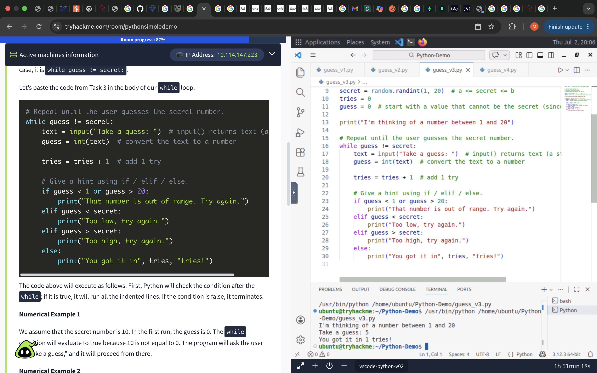
---

## 🔍 Code Execution Breakdown: Building Logic

The core project in this room involves layering multiple fundamental logic blocks to build an interactive application (such as a game logic sequence):

1. **Initialization:** Setting up counter variables (e.g., tracking a user's number of attempts/guesses) and pinning data goals.
2. **Data Manipulation:** Handling the dynamic input processing flow—reading raw user data strings, typecasting strings into integers, and mathematically updating the state variables.
3. **Branching Decisions:** Testing values against upper and lower bounds using logical inequalities to route the system to the correct execution pathway.

---

## 🔍 Key Takeaways
- **Scripting Foundations**: Writing structured, indent-sensitive code provides the essential mindset shift required to read and audit automation scripts.
- **Typecast Invalidation**: Learned that input data always defaults to string formats; explicit mathematical verification requires careful type conversion to prevent system errors.
- **Logical Flow**: Understood how loops control execution flow continuously until an explicit breaking parameter or termination state is met.

---
---

## Lab: JavaScript: Simple Demo (TryHackMe)

## 🖥️ Overview
This lab introduces fundamental client-side web application programming using JavaScript. It explores how the browser executes interactive logic, processes user-driven variables, and handles conditional event routing.

---

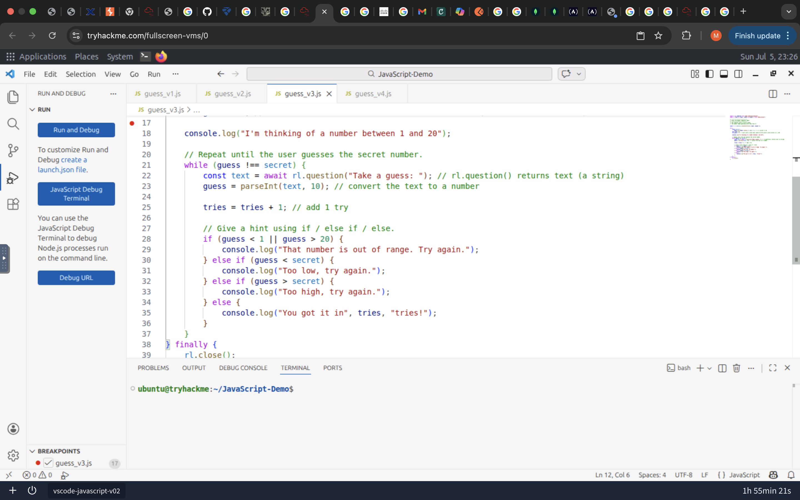
---
## 🔍 Security Context: The Client-Side Attack Surface

Unlike Python scripts which usually execute securely on a closed server or local machine, JavaScript runs **directly inside the user's web browser**. 

*   **Attacker Visibility:** Because JavaScript is client-side, any user or attacker can right-click a web page, inspect the source code, and read the entire script logic. This means secret keys or sensitive logic should never be hardcoded into JavaScript files.
*   **Input Validation Bypass:** Front-end validations written in JavaScript are purely for user experience. Because an attacker has absolute control over their local browser, they can easily disable, alter, or completely bypass JavaScript input rules to inject malicious payloads straight into the backend server.

---

## 🔍 Key Takeaways
- **Browser Execution Environment**: Understood that JavaScript is interpreted live by the browser, making web pages dynamic and interactive rather than completely static.
- **Client vs. Server Logic**: Learned that client-side logic cannot be trusted for ultimate system security; backend systems must always re-verify any data sent by the browser.
- **Syntax Adaptability**: Transitioned smoothly from Python's indentation-based structure to JavaScript's use of curly braces `{}` and explicit statement terminators.

---
---

## Lab: Database & SQL Basics (TryHackMe)

## 🖥️ Overview
This lab covers the essential structural operations of relational databases using Structured Query Language (SQL). It focuses on the fundamental concepts of tables, data attributes, data formatting, and constructing basic queries to manipulate and extract specific information sets.

## ⚙️ Core SQL Components & Security Context

| Keyword / Concept | Operational Function | Security Analyst Perspective |
| :--- | :--- | :--- |
| **`SELECT`** | Dictates exactly which fields or columns to output from a query statement. | Explicitly defining columns instead of using wildcard `*` limits data exposure and preserves system performance. |
| **`FROM`** | Identifies the targeted source database table to extract metrics from. | Essential structural locator; defenders map high-value target tables (like `Users` or `CreditCards`) to spot access threats. |
| **`WHERE`** | Contextually filters database records using conditional constraints. | The frontline vector for SQL Injection (SQLi); input parameters inside WHERE clauses must be strictly parameterized. |
| **`ORDER BY`** | Organizes returned records in ascending or descending alphanumeric sequence. | Can be abused by blind attackers injecting logical sorting variations to guess table values character by character. |

----
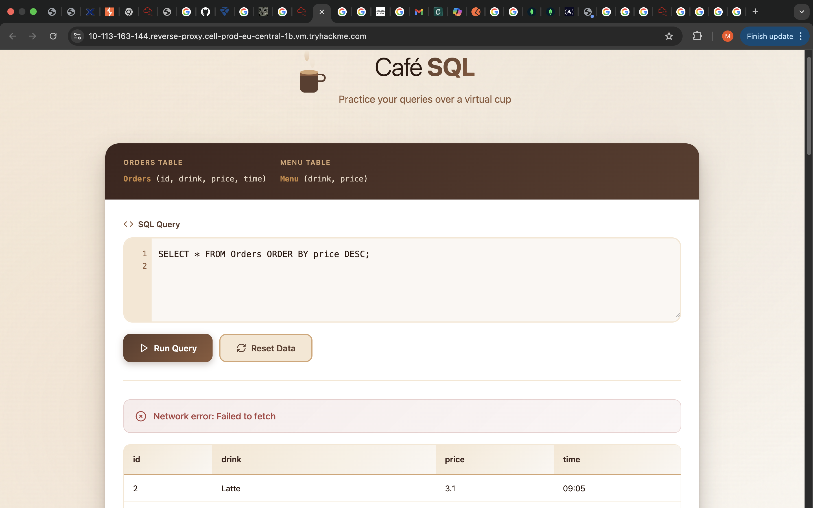
----

---

## 🔍 Key Takeaways
- **The Backend Source of Truth**: Databases are the brain of enterprise web architectures, managing everything from session tokens to payment profiles.
- **Data Filtering Efficiency**: Utilizing structured keywords like `WHERE` enables automated applications to extract specific pieces of evidence from millions of database records in milliseconds.
- **Structural Mapping Mindset**: Understanding native table configurations sets up the prerequisite knowledge needed to audit systems for flawed logic or misconfigured read privileges.

---
---
---

## Lab: Introduction to the CIA Triad (TryHackMe)

## 🖥️ Overview
This lab covers the CIA Triad, the ultimate foundational model for information security. It explores how to balance data privacy, system accuracy, and resource accessibility when designing or auditing modern digital infrastructures.

## ⚙️ Core Pillars & Security Implementations

| Pillar | Core Objective | Technical Controls / Safeguards |
| :--- | :--- | :--- |
| **Confidentiality** | Ensuring that sensitive information is strictly hidden from unauthorized eyes. | Strong symmetric/asymmetric encryption (AES), Access Control Lists (ACLs), multi-factor authentication (MFA). |
| **Integrity** | Guaranteeing that data remains accurate, complete, and un-tampered with during storage or transit. | Cryptographic hashing algorithms (SHA-256), digital signatures, file checksum verifications. |
| **Availability** | Ensuring that authorized users have continuous, reliable access to resources and data when needed. | Hardened server redundancy, load balancers, reliable offsite backups, DDoS mitigation solutions. |

---
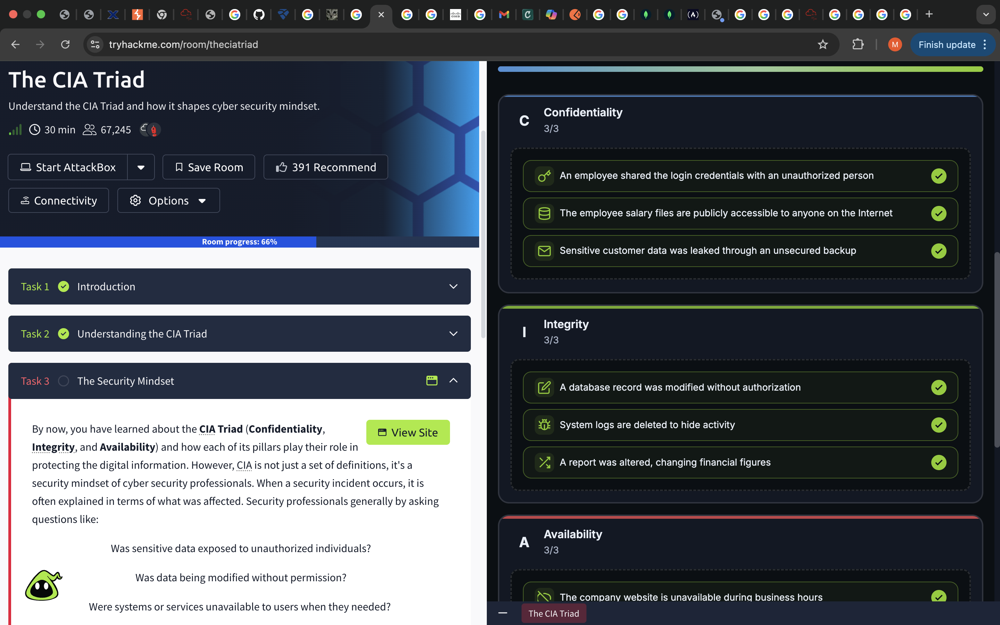
---
## 🔍 Key Takeaways
- **The Core Baseline:** Everything in security (like passwords or firewalls) is built to protect either Confidentiality, Integrity, or Availability.
- **Spotting Unauthorized Changes:** Learned that if someone tempers with or changes a file, its cryptographic fingerprint (hash) will change completely.
- **Keeping Systems Alive:** Availability means setting up backup systems so the network stays up, even during hardware failures or cyber attacks.

  ---

## Lab: Cryptography Concepts (TryHackMe)

## 🖥️ Overview
This lab covers the basic foundations of cryptography. It explains how mathematical rules and secret keys are used to turn readable information into unreadable text to protect sensitive data over the internet.

## 📖 Key Terms
*   **Plaintext:** A normal, readable message that anyone can look at (e.g., `HELLO`).
*   **Ciphertext:** A scrambled, unreadable version of the message that does not make sense (e.g., `KHOOR`).
*   **Key:** The secret password used to lock (encrypt) and unlock (decrypt) the message.
*   **Algorithm:** The public, step-by-step instructions or "recipe" that uses the key to scramble the text.

---
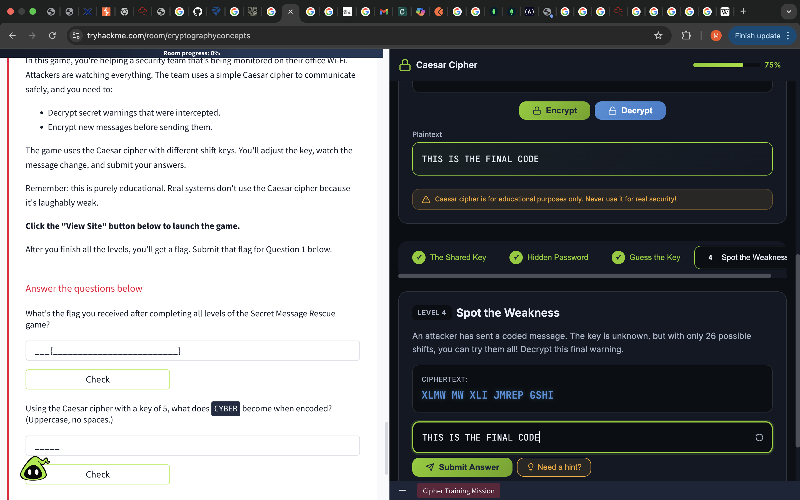
---

## ⚙️ Symmetric vs. Asymmetric Encryption

| Feature | Symmetric Encryption | Asymmetric Encryption |
| :--- | :--- | :--- |
| **How it Works** | Uses **one single key** to both lock and unlock the data. | Uses a **pair of keys**: a Public Key and a Private Key. |
| **Key Sharing** | Both people must secretly share and use the exact same key. | The Public key is shared openly; the Private key is kept a secret. |
| **Speed** | Very fast; great for big files or heavy network traffic. | Slower; mostly used for safely sharing keys and digital certificates. |
| **Analogy** | A heavy lockbox where only one key can open or lock it. | A mailbox where anyone can drop mail inside, but only the owner can unlock it. |

---

## 🔍 Key Takeaways
- **No Math Needed:** Cryptography relies on simple rules to hide secrets. Anyone can know the algorithm, but the secret stays safe as long as the key is kept secret.
- **Symmetric is for Speed:** Using a single key is very efficient for encrypting bulk data, like files on your computer.
- **Asymmetric is for Sharing:** Using two keys lets two strangers communicate securely over the internet without sharing their secret passwords first.
- **In practice, real systems use both:**

-Asymmetric encryption initiates a connection and securely shares a symmetric key.
-Symmetric encryption takes over for the remainder of the session to efficiently handle data.

---
---

## Lab: Intro to Offensive Security (TryHackMe)

## 🖥️ Overview
This lab introduces the world of offensive cybersecurity. It covers the core career paths in ethical hacking, explains the legality of authorized testing, and provides a guided scenario to exploit a web vulnerability to retrieve a hidden flag.

## 📖 Key Concepts 

*   **Penetration Testing:** A structured security assessment where an authorized tester attempts to find and exploit security vulnerabilities before real malicious actors can do so.
*   **Red Teaming:** An advanced security operation that simulates full-scale, real-world cyberattacks against a company to test how well their defensive teams respond.
*   **Ethical Hacking:** The practice of hacking into a computer system with explicit, written permission from the owner to improve system security.
*   **Vulnerability:** A weakness or security flaw in a computer system or software application that allows an attacker to compromise the system.
---

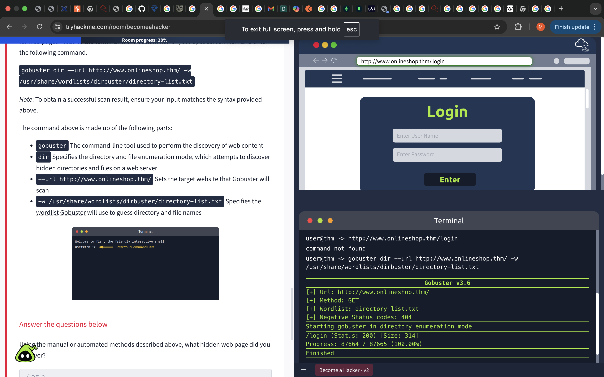
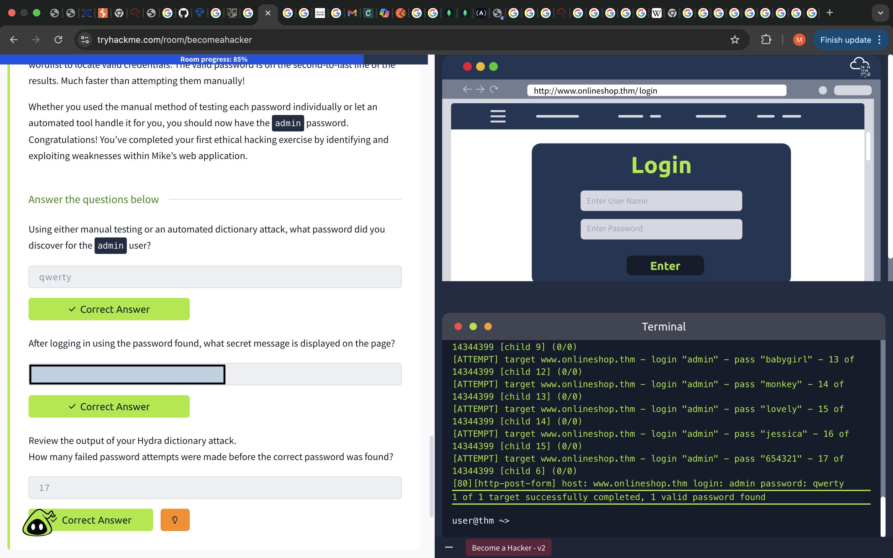

---

## ⚡ Hands-on Exploitation (Web Hack Scenario)

The hands-on exercise in this room involves running a web browser exploit against a target application to bypass traditional controls.

1. **Reconnaissance:** Inspecting a website layout to identify hidden parameters or exposed pages.
2. **Exploitation:** Modifying URL strings or input data to manipulate how the backend application executes instructions.
3. **Retrieving the Flag:** Successful unauthorized entry into the directory allows access to the target tracking string or flag file.

---

## 🔍 Key Takeaways
- **Hacking Requires Permission:** Legal hacking is called "offensive security" and must have formal paperwork. Running exploits without authorization is illegal.
- **Thinking Like the Enemy:** To properly protect a network, defenders must learn how attackers choose their targets and execute exploits.
- **Breaking Down Complex Controls:** Small bugs or human mistakes in web pages are often all it takes for a hacker to compromise an entire machine.

---
## Lab: Become a Defender (TryHackMe)

## 🖥️ Overview
This lab introduces the core responsibilities of Defensive Security (the Blue Team). It covers the mindset needed to look at an entire system infrastructure, anticipate how threat actors pivot through networks, and implement controls to protect high-value assets.

## 📖 Key Defensive Concepts

*   **Prevention:** Putting security controls in place to stop attacks before they happen, such as firewalls, antivirus software, and regular patching.
*   **Detection:** Monitoring systems and networks to identify suspicious or malicious activity through logs, alerts, and security tools.
*   **Mitigation:** Taking action during an incident to limit damage, such as blocking traffic, isolating affected systems, or disabling compromised accounts.
*   **Analysis:** Investigating what happened, how it happened, and which systems were affected by reviewing logs and other evidence.
*   **Response & Improvement:** Recovering from the incident and improving defenses to reduce the risk of similar attacks in the future.

## 🛡️ The Core Defender Mindset

Defending a system requires thinking like a designer and an architect, using four simple strategies:

*   **Threat Anticipation:** Looking at your network and asking "What if?" to imagine the realistic paths an attacker might take to steal data.
*   **Attack Awareness:** Studying common attack steps to understand how a threat actor moves from a basic phishing email to taking over a main server.
*   **Risk Prioritization:** Identifying your most critical systems (like customer databases) and giving them extra defense layers over low-risk systems.
*   **Continuous Adaptation:** Treating security as an ongoing process that evolves as new vulnerabilities and hacker techniques emerge over time.

---
## 🔍 Key Takeaways
- **Systems are Connected:** Attackers rarely hit just one target; they compromise a weak device and pivot to the next, meaning defenders must secure the whole chain.
- **Visibility is Security:** You cannot protect a server or a computer if you do not know it exists on your network.
- **Proactive Defending:** Good blue teaming isn't just waiting for an alert to pop up; it means hunting for weaknesses and blocking attack paths before they are used.

---

---
 ----
 ----
 ----
 ----
 ----
 ----

# **Cyber-101**

| Lab Name | Category | Key Skill Learned | Status |
| :--- | :--- | :--- | :--- |
| **Intro to Networking** | Networking | OSI Model & TCP/IP Handshake | ✅ Completed |
| **Linux Fundamentals** | Operating Systems | Terminal Navigation & Permissions | ✅ Completed |
| **Nmap Basics** | Enumeration | Network Scanning & Port Discovery | ✅ Completed |
| **Cryptography** | Security | Mastered Hashing (SHA-256) vs Encryption (AES/RSA) | ✅ Completed |
| **Moniker** | Exploitation | CVE-2024-21413 (MonikerLink) NTLM leaks via SMB | ✅ Completed |
| **Metasploit Intro** | Tools | MSF Framework, Meterpreter, and msfdb management | ✅ Completed |
| **Metasploit Exploitation** | Tools | SMB Enumeration & Credential Auditing | ✅ Completed |
| **Metasploit Meterpreter** | Post Exploitation | Process Migration, Hash dumping, and Enumeration | ✅ Completed |
| **Blue (MS17-010)** | Exploitation |  	Full Kill-Chain: Recon, MS17-010 Exploit, PrivEsc & Hash Cracking. | ✅ Completed |
| **Web Application Basics** | Web Security| Core components of web applications, client-server models, and standard web technologies | 🟩 In Progress |

---

### 🔍 Technical Evidence & Writeups

#### **Metasploit: SMB Credential Audit**
Successfully identified weak credentials for user `penny` using a dictionary attack.

#### **Metasploit: Exploitation (EternalBlue)**
- **Vulnerability:** MS17-010 (EternalBlue)
- **Payload:** `windows/x64/meterpreter/reverse_tcp`
- **Result:** Gained **NT AUTHORITY\SYSTEM** privileges.

#### **Post-Exploitation & Data Exfiltration**
- **Proof of Access:** Read `flag.txt` via Meterpreter.
- **Credential Harvesting:** Executed `hashdump` to extract NTLM hashes.
- **Finding:** Retrieved NTLM hash for user `pirate` for potential Pass-the-Hash attacks.

#### **Privilege Escalation & Credential Harvesting**
- **Method:** Local Privilege Escalation via `sudo` misconfiguration.
- **Action:** Leveraged root-level permissions to access restricted files.
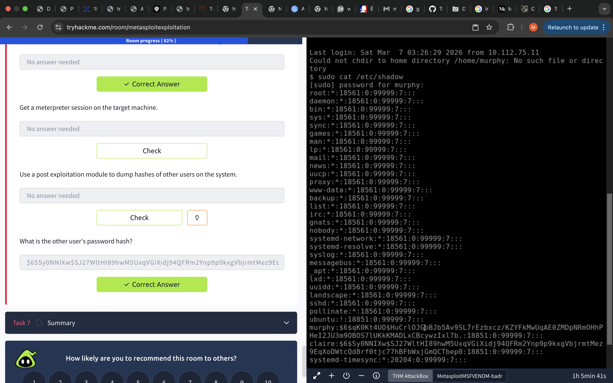

> [!IMPORTANT]
> **Internship-Level Insight:** 
> "While standard Metasploit modules were restricted, I successfully pivoted to manual Linux enumeration. By identifying a sudoers misconfiguration, I achieved full system compromise, demonstrating the ability to maintain momentum when automated tools reach their limits."

---

### 🛠️ Meterpreter Deep Dive
1. **Recon:** 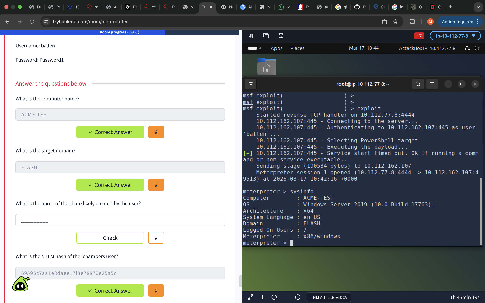
2. **PrivEsc:** 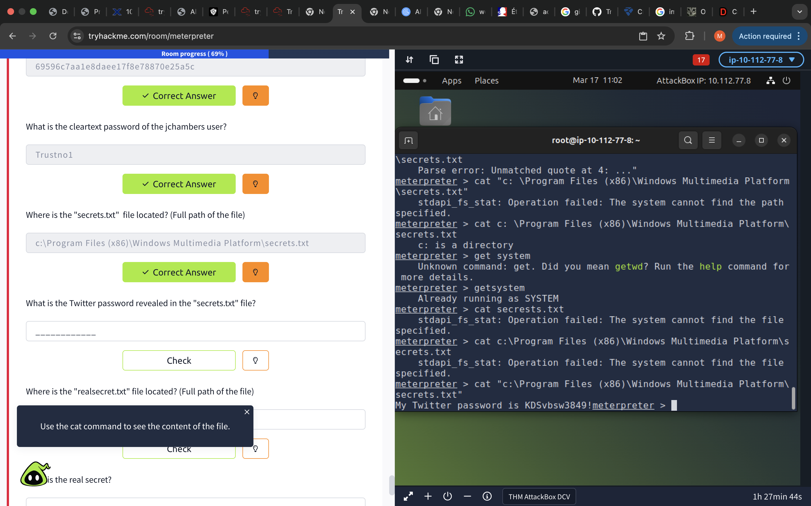
3. **Hashes:** 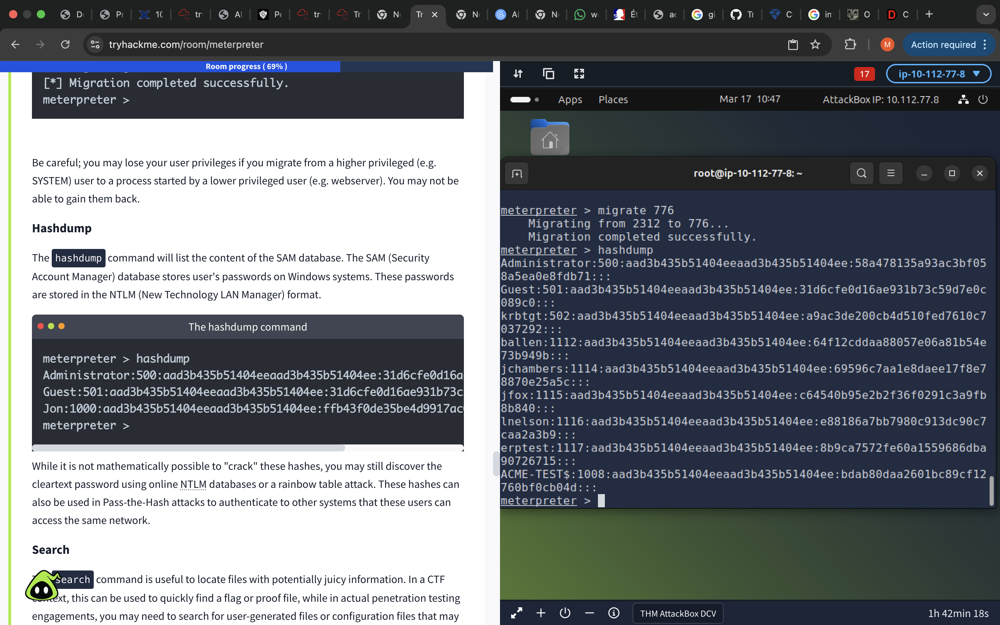
4. **Exfiltration:** 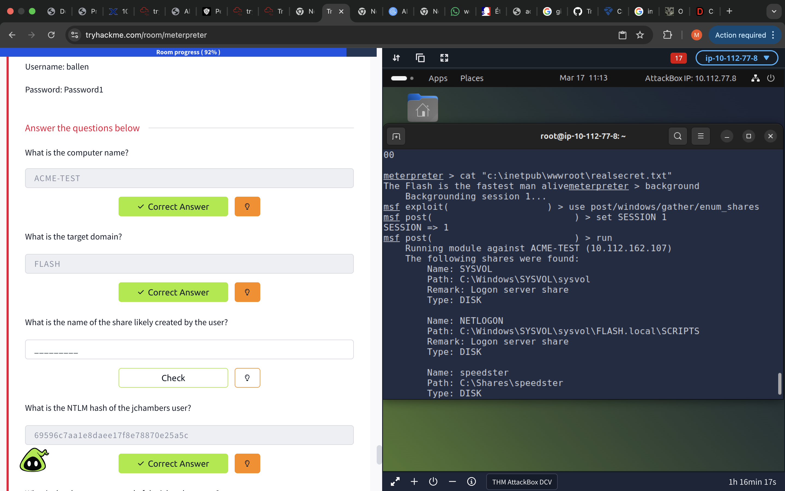

---

### 📑 Lab Notes: Blue (MS17-010)
* **Phase 1(Recon):
After scanning the target with Nmap, I ran a vulnerability script to check for common SMB flaws.

 **Vulnerability Scan:** 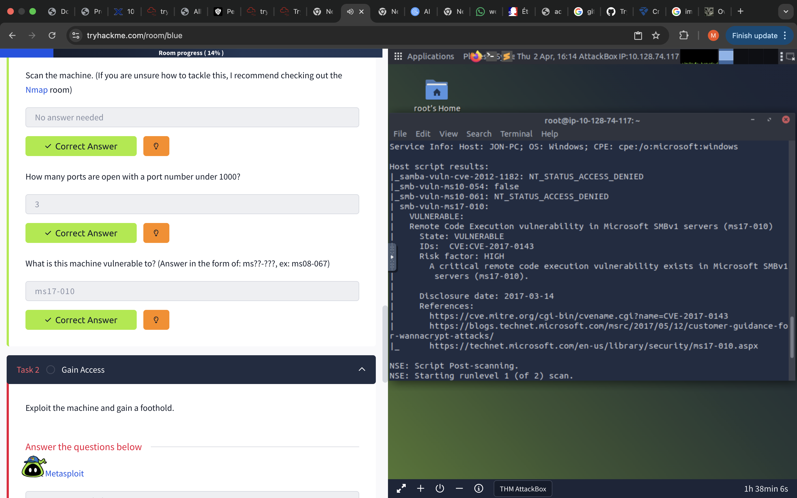
 *The scan confirms the target is vulnerable to MS17-010 (EternalBlue).*

### 2. Exploitation & System Information
After confirming the vulnerability, I used the `ms17_010_eternalblue` Metasploit module to gain a stable Meterpreter session. 

**System Verification:**
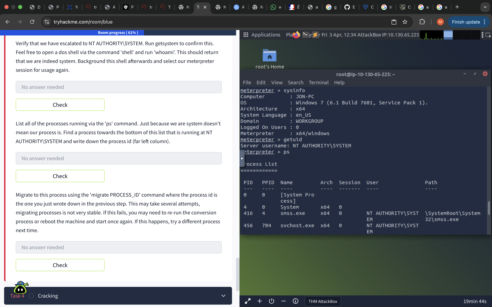

*   **Target OS:** Windows 7 (64-bit)
*   **Access Level:** NT AUTHORITY\SYSTEM

### 3. Persistence & Privilege Verification
To ensure a permanent foothold, I migrated the Meterpreter session into the **lsass.exe** process. This is a critical system service responsible for security policy enforcement.

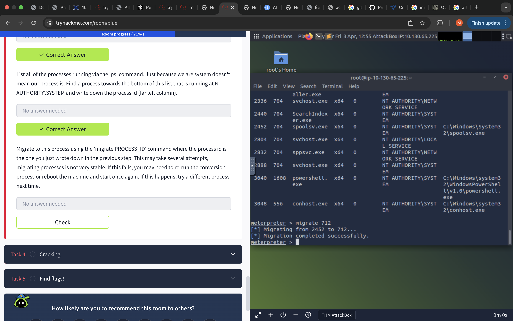

*   **Migration Target:** lsass.exe (System Process)
*   **Access Level:** NT AUTHORITY\SYSTEM

### 4. Credential Harvesting & Cracking
After gaining SYSTEM access, I dumped the local SAM database hashes. I then performed an offline dictionary attack against the user **Jon's** NTLM hash.

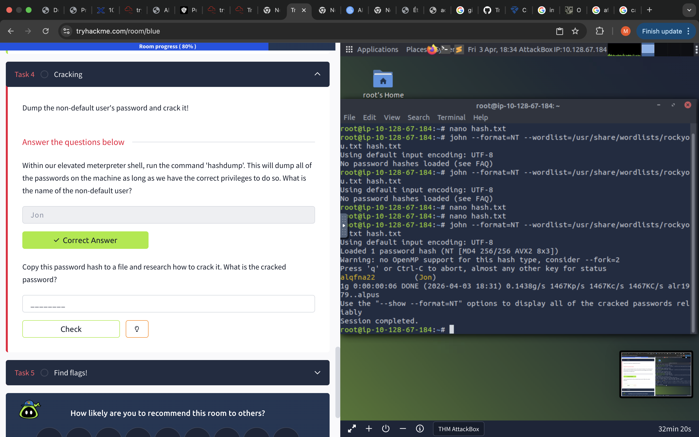

*   **Tool:** John the Ripper
*   **Wordlist:** rockyou.txt
*   **Result:** Successfully recovered plain-text password for user: **Jon**

  Post-Exploitation: Successfully located three system flags hidden across the machine (System Root, SAM Database config, and Administrative Documents) to confirm full system compromise.

## 💼 Virtual Internships (Job Simulations)

| Company | Program | Task Completed | Key Skill |
| :--- | :--- | :--- | :--- |
| **Mastercard** | [Cybersecurity](https://www.theforage.com) | Phishing Analysis (Task 1) | Threat Detection & Social Engineering |
.
